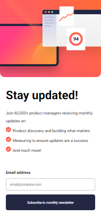
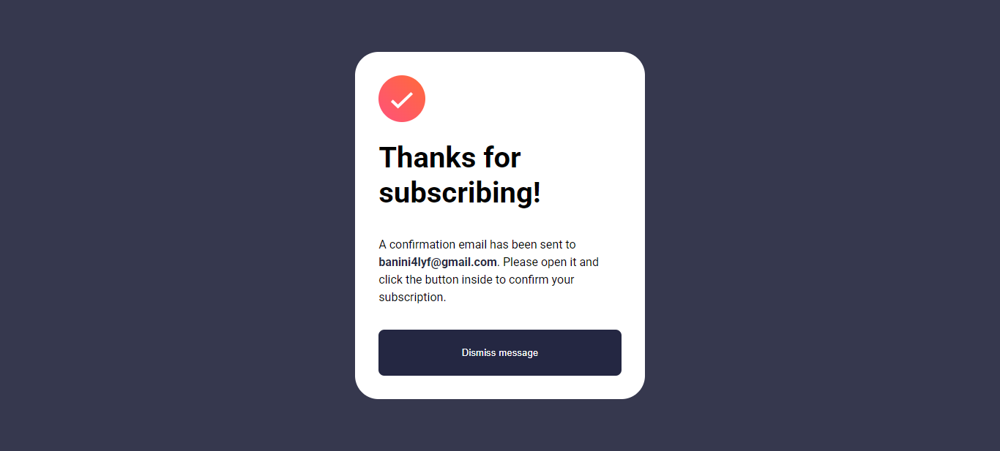
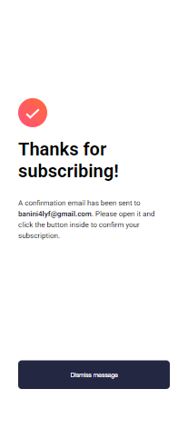

# Frontend Mentor — Newsletter Sign-up Form with Success Message

This is my solution to the [Newsletter sign-up form with success message challenge](https://www.frontendmentor.io/challenges/newsletter-signup-form-with-success-message-3FC1AZbNrv) on Frontend Mentor.

---

## Table of contents

- [Frontend Mentor — Newsletter Sign-up Form with Success Message](#frontend-mentor--newsletter-sign-up-form-with-success-message)
  - [Table of contents](#table-of-contents)
  - [Overview](#overview)
    - [The challenge](#the-challenge)
    - [Screenshot](#screenshot)
  - [](#)
    - [Links](#links)
  - [My process](#my-process)
    - [Built with](#built-with)
    - [What I learned](#what-i-learned)
    - [Continued development](#continued-development)
  - [Author](#author)

---

## Overview

### The challenge

Users should be able to:

- Add their email and submit the form
- See a success confirmation message with their email address after successfully submitting the form
- See form validation messages if the email field is empty or the email address is not formatted correctly
- See the email input field turn red when an invalid email is submitted
- View the optimal layout for the interface depending on their device's screen size

### Screenshot





---
### Links
  - Solution URL: [The Github Solution](https://github.com/Banini-AD/Newsletter)
- Live Site URL: [The live Site](https://newsletter-8gyx.vercel.app/)
## My process

### Built with

- Semantic HTML5 markup
- Sass
- Vanilla JavaScript (ES6)
- `sessionStorage` for passing the email between pages
- Mobile-first responsive design

### What I learned

One key thing I learned was how to pass data between two separate HTML pages without a backend, using `sessionStorage` :wink::

```js
// On the form page — save the email before redirecting
sessionStorage.setItem("subscriberEmail", email);
window.location.href = "success.html";

// On the success page — read and display it
const email = sessionStorage.getItem("subscriberEmail");
successEmail.textContent = email;
sessionStorage.removeItem("subscriberEmail");
```

I also learned the importance of guarding against `null` DOM elements when a single JavaScript file is shared across multiple pages:

```js
// Without this guard, the script crashes on success.html
// because #newsletter-form doesn't exist there
if (form) {
  form.addEventListener("submit", (e) => {
    handleSubmit(e);
  });
}
```

### Continued development

In future projects I'd like to:

- Explore using the HTML5 Constraint Validation API instead of a custom regex
- Add CSS transitions to make the error state feel smoother
- Try a single-page approach using `display: none` toggling instead of separate HTML files

---

## Author

- Frontend Mentor — [@Banini-AD](https://www.frontendmentor.io/profile/Banini-AD)